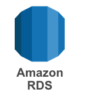
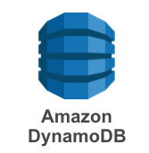

# AWS 기초 코스: 5교시 
## 데이터베이스 및 기타 서비스들 
### CodeSquad

---
<!-- page_number: true -->
# RDS
AWS 관리형 데이터베이스 서비스 
관계형 데이터베이스 관리의 부담을 완전히 줄여준다. 
## 종류
- Aurora
- Oracle, MySQL, MS-SQL, Postgres, MariaDB

---
# RDS의 특징 
- 관리의 부담이 대폭 경감
    - 온프레미스 VS 클라우드 IASS VS RDS 
- 리전 기반 서비스 
- multi AZ 지원

---
# RDS 자동 백업과 복구 
- 이중화 지원 및 자동 복구 
- 자동 백업과 백업을 이용한 수동 복구 가능 
- 읽기 복제를 통한 읽기 분산 
- 크로스 리전 복제를 통한 가용성 향상 

---
# DynamoDB 
- 완전 관리형 NoSQL 데이터베이스 
- 인스턴스 없이 데이터 베이스 사용 가능 
- 고성능, 수평 확장, 내구성 
- 세션 DB, 게임 등 다양한 응용에 사용 
 

---
# 그 외 중요한 서비스들 
- Cloud Watch
- CloudFront
- Elastic Cache
- Elastic BeanStalk
- AWS Lambda
- SNS, SES, SQS
- EC2 container
- EMR
- ... 

---

# 강사 데모 
1. api gateway + lambda + dynamoDB를 이용한 Simple REST API

---
# 실습5 RDS 시작하기

