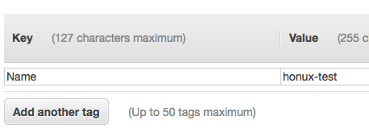

# CodeSquad AWS 초급 과정 실습 가이드

## 실습3. EC2 사용해 보기

 ### 1. AWS 관리 콘솔에 로그인하기

a. 실습 1에서 만든 계정 정보를 이용해 로그인한다.


b. 로그인 후 미리 안내받은 리전을 선택한다.


### 2. putty 및 puttygen 다운로드 (Windows 전용)

- 맥의 경우, 이 단계는 패스한다.

a. http://www.chiark.greenend.org.uk/~sgtatham/putty/latest.html 에서 `putty.exe`와 `puttygen.exe`를 다운로드한다.

b. 다운로드 링크가 정상동작하지 않을 경우 구글 검색을 통해 동일 파일을 다운로드한다.


### 3. EC2 인스턴스의 키페어 생성 및 다운로드하기  

a. 본인의 리전을 먼저 선택하고 `Services` - `EC2` 를 선택한다.

b. 왼쪽 메뉴에서  `Key Pairs` 메뉴를 클릭한다.

c. `Create Key Pair` 버튼 클릭

d.Key pair name: 에 적당한 이름(예: cs-keypair)을  넣고 Create 를 클릭한다.

e. 브라우저 아래에 자동으로 다운로드 되므로 경로를 확인하고 `pem` 파일이 존재하는 지를 확인한다.


### 4. pem 파일 ppk로 변환하기 (Windows 전용)

- 맥의 경우, 이 단계는 패스한다.

a. 2에서 다운받은 puttygen을 실행한다.


b. Conversions - import key 를 선택하고 앞에서 다운받은 pem 파일을 선택한다.  화면에 ssh-rsa로 시작하는 키값이 표시되면 `Save private key`버튼을 클릭하고, 이어 나오는 대화상자에서는 `Yes`를 선택한다. 적당한 파일이름을 입력해서 `.ppk`파일을 만든다.


### 5. EC2 인스턴스 생성하기

a. [Services] - [EC2] 선택

b. `Instaces` 클릭 후 이어서 `Launch Instance` 를 클릭한다.

c. AMI 선택 단계에서 Amazon Linux를 선택


d. 유형은 t2.micro 선택 후  `Next: Configure Instance Details` 클릭

e. 아래의 값을 선택한다.

> Network: vpc | default
>
> Autoassign Public IP |. Enable

f. Advanced Details  왼쪽의 세모를 눌러 확장 메뉴를 보이게 한다.  User-data에 아래 내용을 붙여넣는다.

```Bash
#!/bin/bash
yum -y install httpd php
chkconfig httpd on
/etc/init.d/httpd start
```

g. Add Storage: 기본 옵션 선택

h. Add Tags: `Add Tag`버튼을 클릭하고 Name Key에 아래처럼 구분 가능한 이름을 넣는다. `Name` Key의 N은 반드시 대문자로 입력한다.



h. Security Group 설정: Add Rule을 눌러 HTTP를 추가한다.


i. `Review and Launch`를 클릭, `Launch`를 클릭한다.

j. 키페어 선택 화면에서 `exising key pair` 와 앞단계에서 생성한 키페어를 선택한다. 아래쪽 체크박스도 체크한다. `Launch Instance`를 눌러 인스턴스 생성을 완료한다.

k. `View Instance`를 클릭 후, `Status Check`가 `2/2`가 될 때까지 기다린다. 약 5분 소요.

l. `Description` 탭에서 Public DNS  혹은 IPv4 Public IP 주소를 복사해서 브라우저 창으로 열어본다.  추가로 해당 주소를 메모장 등에 기록해 놓는다.

m. 아파치 테스트 화면이 보이면 OK


### 6-1. EC2 인스턴스에 접속하기 (Windows 용)

a.  다운받은 putty를 실행한다.

b. Connection - SSH - Auth - Browse 클릭 후 전단계에서 생성한 `ppk`파일을 선택한다.


c. Session - Host Name 에 `ec2-user@서버아이피`로 기입한다.

d. save session 에 적당한 이름을 기입하고, `save`버튼을 누른다.


e. `open`을 클릭, 접속이 되는지 확인한다.

### 6-2. EC2 인스턴스에 접속하기 (mac 용)

a. 다운받은 pem 파일이 있는 폴더로 이동한 후 아래 명령을 통해 접속을 할 수 있다.
```
chmod 400 mypemfile.pem
ssh -i mypemfile.pem ec2-user@서버ip
```

### 7. Meta-data 및 User-data 확인하기

a. putty 터미널 (이하 터미널) 에서 아래 명령을 입력한다.  결과값들을 관리 콘솔의 값들과 비교해 본다.

> curl -s -w '\n' 169.254.169.254/latest/user-data
>
> curl -s -w '\n' 169.254.169.254/latest/meta-data/instance-id
>
> curl -s -w '\n' 169.254.169.254/latest/meta-data/public-ipv4
>
> curl -s -w '\n' 169.254.169.254/latest/meta-data/ami-id

b. 터미널에서 아래 명령을 입력해서 간단한 텍스트 파일을 하나 생성한다.

> echo "Today is $(date)" > hello.txt
>
> cat hello.txt


### 8. 커스텀 AMI 만들기

a. `EC2` - `Instances`에서 만들어져 있는 인스턴스를 선택한다.

b. 위쪽은 `Actions` - `Image` - `Create Image`를 선택한다.

c. Create Image 대화창에서 `Image name`에 적당한 이름을 넣는다.

d. `Create`버튼을 클릭한다.


e. `Close`버튼 클릭.

f. `EC2` - `AMIs` 메뉴 클릭. 오른쪽 상단의 새로 고침 버튼을 주기적으로 클릭하며 커스텀 AMI가 생성되는 것을 확인한다.


### 9. 도전과제

생성된 AMI 로부터 다시 인스턴스를 생성해 본다. user-data는 입력하지 않는다. 웹서버의 정상 동작 여부와, 전단계에서 생성한 hello.txt 파일이 저장되어 있는지 확인하자.


### 10. 도전과제2

아래 링크를 참고해서 goofys를 사용해 보자.

http://bluese05.tistory.com/23


### 11. 인스턴스 종료하기

생성된 인스턴스를 `Actions` - `Instance State` -`Terminate` 를 차례로 클릭. 모두 삭제한다.


#### 수고하셨습니다. 실습3을 완료하셨습니다.
