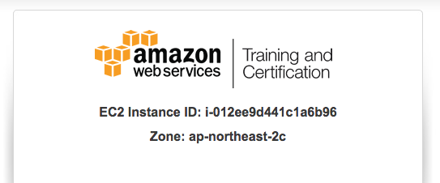
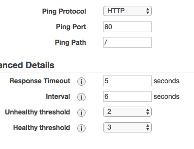

# CodeSquad AWS 초급 과정 실습 가이드

## 실습4. ELB 사용해 보기 

 ### 1. AWS 관리 콘솔에 로그인하기 

a. 실습 1에서 만든 계정 정보를 이용해 로그인한다. 


b. 로그인 후 미리 안내받은 리전을 선택한다. 


### 2. EC2 인스턴스 2대 생성하기 

a. [Services] - [EC2] 선택

b. `Instaces` 클릭 후 이어서 `Launch Instance` 를 클릭한다. 

c. AMI 선택 단계에서 Amazon Linux를 선택

​:exclamation: 다른 버전의 리눅스를 선택하면 정상적으로 동작이 안 됩니다. 


d. 유형은 t2.micro 선택 후  `Next: Configure Instance Details` 클릭

e. 아래의 값을 선택한다. 

> Number of instances: 2
>
> Network: vpc | default
>
> Autoassign Public IP:  Enable 

f. Advanced Details  왼쪽의 세모를 눌러 확장 메뉴를 보이게 한다.  User-data에 아래 내용을 붙여넣는다. 

```Bash
#!/bin/bash
curl -L http://public.codesquad.kr/files/php-example.sh | sh
```

g. Add Storage: 기본 옵션 선택

h. Add Tags: `Add Tag`버튼을 클릭하고 Name Key에 아래처럼 구분 가능한 이름을 넣는다. `Name` Key의 N은 반드시 대문자로 입력한다. 


h. Security Group 설정: Add Rule을 눌러 HTTP를 추가한다. 


i. `Review and Launch`를 클릭, `Launch`를 클릭한다.

j. 키페어 선택 화면에서 `exising key pair` 와 앞단계에서 생성한 키페어를 선택한다. 아래쪽 체크박스도 체크한다. `Launch Instance`를 눌러 인스턴스 생성을 완료한다.

k. `View Instance`를 클릭 후, `Status Check`가 `2/2`가 될 때까지 기다린다. 약 5분 소요. 

l. `Description` 탭에서 2대 각각의 Public DNS  혹은 IPv4 Public IP 주소를 복사해서 브라우저 창으로 열어본다. 아래와 같은 화면이 나오면 정상 동작 중인 것이다. 




### 3. ELB 생성하기 

a. `Services` - `EC2`  의 왼쪽 메뉴에서  `Load Balances`를 선택한다. 

b. `Create Load Balancer`를 클릭 

c. `Classic Load Balancer`를 선택, `Continue` 클릭 

d. Step1에서 Load Balancer name: 에 적당한 이름을 입력한다. (ex: myelb). `next: Assgin Security Groups` 클릭

e. 전 단계에서 만들었던 보안그룹 (이름을 변경하지 않았다면 launch-wizard로 시작)을 선택한다. `Next: Configure Security Settings` 클릭

f. Step3의 경고는 무시하고, `Next: Configure Health Check` 클릭 

g. Stet4 의 값들을 아래 내용으로 변경하고, `Next: Add EC2 Instances`클릭 

> Ping Path: / 
>
> Interval: 6
>
> Healthy threshold: 3



h. `Name`태그를 확인하고 직전에 생성한 두 대의 인스턴스 선택, `Next` `Review and Create` `Create` `Close`차례로 선택 

i. `Load Balancers`의 `Instaces` 탭에서 각 인스턴스의 Status가 `In Services`가 되는지 확인. 시간이 약간 걸린다. 


j. `Load Balancers` `Description`탭에서 생성한 ELB의 DNS이름을 복사 후 익스플로러를 열어 본다. (크롬에서는 강력 새로 고침이 필요) 새로 고침을 하면서 instance-id가 변경되는 것을 확인한다. 


### 4. 인스턴스 종료하기

생성된 인스턴스를 `Actions` - `Instance State` -`Terminate` 를 차례로 클릭. 모두 삭제한다. 

생성했던 로드 밸런서도 종료한다. 

#### 수고하셨습니다. 실습4를 완료하셨습니다. 


