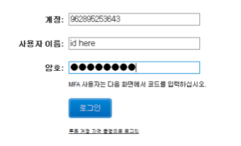
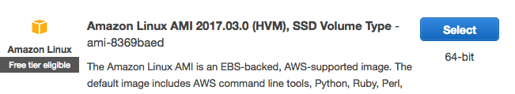
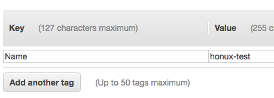

# CodeSquad AWS 초급 과정 실습 가이드

## 실습5. RDS 사용해 보기 

 ### 1. AWS 관리 콘솔에 로그인하기 

a. 실습 1에서 만든 계정 정보를 이용해 로그인한다. 



b. 로그인 후 미리 안내받은 리전을 선택한다. 


### 2. RDS 인스턴스 1대 생성하기 

a. `Services` - `RDS` 선택 

b. `Instances` - `Launch DB Instance`선택 

c. `MySQL`-`select` 각각 클릭

d. [Step 2: Production?] 에서  오른쪽 Dev/Test 항목 아래의 MySQL 선택, `next step`클릭 

e. [Step3: Specify DB Details] 에서 각각 아래 항목 선택 

> DB Instance Class: t2.micro 
>
> Multi-AZ Deployment: No
>
> Storage Type: General Purpose
>
> DB Instance Identifier: mydbinstance
>
> Master Usrename: myadmin
>
> Master Password: aws12345
>
> Confirm Password: aws12345

f. `next` 클릭 

g. [Step4: Configure Advanced Settings] 에서 Database Name에 mydb 입력 

h. `launch DB instance`클릭. 완료되는데 시간이 소요되므로 3단계를 수행한다. 


### 3. EC2 인스턴스 생성하기 

a. [Services] - [EC2] 선택

b. `Instaces` 클릭 후 이어서 `Launch Instance` 를 클릭한다. 

c. AMI 선택 단계에서 Amazon Linux를 선택



d. 유형은 t2.micro 선택 후  `Next: Configure Instance Details` 클릭

e. 아래의 값을 선택한다. 

> Number of instances: 1
>
> Network: vpc | default
>
> Autoassign Public IP:  Enable 

f. Add Storage: 기본 옵션 선택

g. Add Tags: `Add Tag`버튼을 클릭하고 Name Key에 아래처럼 구분 가능한 이름을 넣는다. `Name` Key의 N은 반드시 대문자로 입력한다. 



h. `Review and Launch`를 클릭, `Launch`를 클릭한다.

i. 키페어 선택 화면에서 `exising key pair` 와 앞단계에서 생성한 키페어를 선택한다. 아래쪽 체크박스도 체크한다. `Launch Instance`를 눌러 인스턴스 생성을 완료한다.

 

### 4. RDS 보안 그룹 설정 변경하기 

a. `Services` - `EC2`에서 Security Groups 선택 

b. 보안 그룹 목록에서 Group Name이 `rds-launch-wizard`인 보안 그룹 선택 

c. 화면 아래의 Inbound 탭 클릭, `Edit`클릭 

d. 오른쪽의 Source를 `Anywhere` 로 수정 `Save`클릭 


### 5. EC2 인스턴스 접속 및 mysql 클라이언트 설치 

a. putty등을 이용해 EC2 인스턴스에 접속한다. 

b. 터미널에서 아래 명령을 수행한다.

```
sudo yum install mysql
```

c. 매지니먼트 콘솔에서 `Services`-`RDS`-`Instances`클릭 

d. 목록에서 mydbinstance 클릭 후 Endpoint 정보를 클립보드나 메모장 등에 저장하고 Status가 available 상태가 될 때까지 기다린다.

e. 준비가 되었을 경우 다시 터미널로 돌아와 아래 명령으로 접속한다. 호스트 주소에서 :3306은 지워야 한다.

```
mysql -u myadmin -h 디비인스턴스주소 -p 
```

f. 정상적으로 로그인이 되면 간단한 SQL을 입력해 본다. 

```
show databases;
use mydb;
CREATE TABLE SAMPLE (A INT PRIMARY KEY, B VARCHAR(255));
INSERT INTO SAMPLE VALUES (1 , 'hello');
SELECT * FROM SAMPLE;
```

  

### 6. 인스턴스 종료하기

생성된 RDS 및 EC2 인스턴스를 모두 종료한다. 


#### 수고하셨습니다. 실습5를 완료하셨습니다. 


