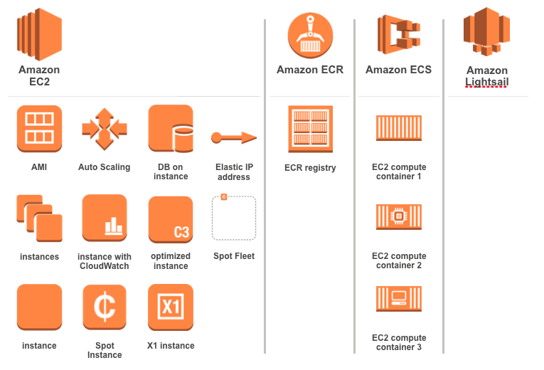
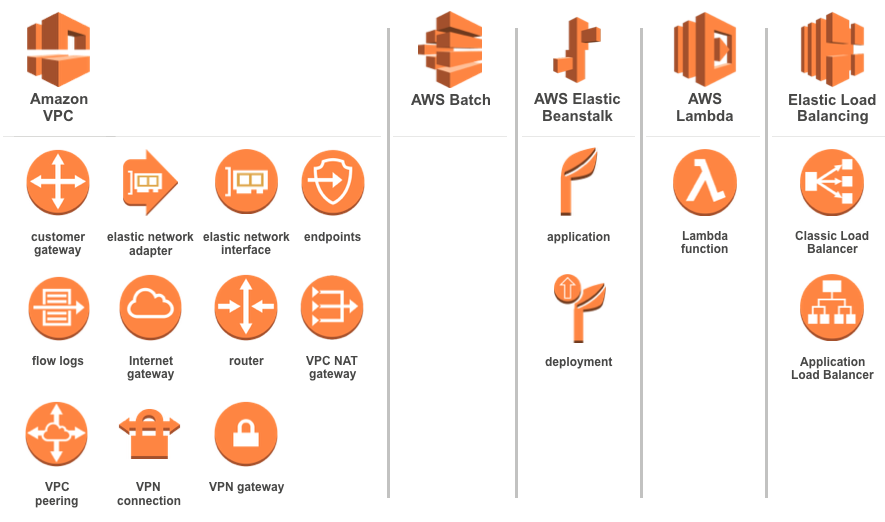
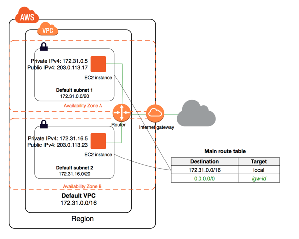

# AWS 기초 코스: 3교시 
## Elastic Compute Cloud 
### CodeSquad

---
<!-- page_number: true -->
# EC2 
Elastic Compute Cloud 
AWS의 대표적인 컴퓨팅 서비스 

---
# AWS Computing Services

---

---
# EC2의 특징
- 사용한 만큼 요금 지불 
- 최소 사용 단위: 시간  
    - 5분 사용후 끄면: 한시간 비용 과금 
- Linux, Windows 공식 지원 
- 비공식(?)으로 freeBSD도 사용 가능 

# EC2에서 고가용성을 확보하기
- EC2와 관련 서비스는 AZ 기반 
- multi AZ를 통해 고가용성 확보 가능 

---
# EC2 관련 서비스들 
- VPC: 서비스 전체의 네트워크 망
- subnet: VPC를 구성 요소 별로 나눈 서브 네트워크 
    - 웹서버 서브넷, 디비 서브넷, VPN 전용 서브넷 등
    - **EC2는 서브넷에 연결된다.**
- eni: EC2와 연결하는 가상 네트워크 어댑터 
- **security group: EC2의 방화벽, 포트 접근 제어**

---
# EC2 관련 서비스들 2 
- EBS: EC2에 연결되는 가상 SSD
- AMI: EC2를 시작할 때 사용하는 이미지, 백업에도 사용됨
- ELB: EC2를 위해 제공되는 로드밸런서
- Auto Scaling: EC2의 확장성을 위해 제공되는 서비스. 매우 유명하다! 

---
# EC2와 VPC

---
# EC2 시작하기 
0. 관리 콘솔 로그인 및 리전 선택 
1. Service - EC2 선택
2. 사용할 AMI 선택 
3. VPC 선택
4. subnet 선택
5. (선택) user-data 입력 
5. EBS와 연결 
6. 보안그룹 설정 
7. key pair 선택 

---
# EC2의 key pair 
.pem 파일 
EC2 인스턴스 접속에 사용됨 
최초 생성시에만 다운로드 가능, 이후에는 다운로드 불가능
**key pair 분실시 해당 인스턴스에는 접속 불가능**
**aws에서는 key pair를 재발급해주지 않음**

* putty의 경우 pem파일을 ppk로 변환해야 ec2에 접속 가능함 

---
# EC2 접속하기 
- 리눅스: 직접 key-pair를 이용해서 접속
- 윈도우: key-pair를 이용 패스워드 복호화 
- 사용자 아이디는 AMI별로 다름 

> windows: Administrator
> Amazon Linux: ec2-user
> Ubuntu Linux: ubuntu

---
# EC2 유형
https://aws.amazon.com/ko/ec2/instance-types/

---
# EC2 마켓플레이스
https://aws.amazon.com/marketplace/

---
# meta-data와 user-data

ec2 인스턴스 안에서 169.254.169.254에 HTTP GET 요청을 하면 meta-data와 user-data 정보를 볼 수 있다. 

> $ curl -s -w '\n' 169.254.169.254/latest/meta-data/instance-id
i-08a3e28a760b20d99

---
# Security Group
EC2 인스턴스의 기본 방화벽 
상태 저장 
CIDR 표기법을 이용해 개방할 IP 대역대 지정 가능
프로토콜과 포트 지정 가능
주로 인바운드에 대해 설정함

---
# Security Group 2 
주로 사용하는 포트들 
> HTTP
> HTTPS 
> TCP 8000 
> SSH
 
필요한 포트만 개방하고 나머지는 모두 닫는 것이 좋다.
SSH, mysql port등은 필요한 IP에만 개방 권장 
입력 범위에 **다른 보안 그룹 아이디**도 사용 가능 

---
# EC2, EBS, S3 
EC2의 디스크로는 EBS를 사용하며 EC2와 EBS는 별도로 과금됨
- EC2: stop시에는 과금이 되지 않음
- EBS: 생성시점부터 삭제시점까지 계속 과금됨 

EBS는 S3에 비해 가격이 매우 비싸고 안정성이 낮으므로 서비스의 컨텐츠 저장소 등의 용도로는 S3를 사용해야 함 

---
# EC2 인스턴스의 백업
## EBS만 백업하고 싶을 경우
- EBS snapshot 이용

## EC2 인스턴스 자체를 백업하고 싶을 경우
- Custom AMI 생성 
- AMI에는 EBS 스냅샷이 포함되어 있다. 

스냅샷과 AMI는 모두 내부적으로 S3에 저장된다. 

---
# EC2 인스턴스의 커스텀 백업 
- 스크립트 등을 이용한 커스텀 백업도 가능
- 백업 데이터는 S3에 저장할 것을 권장 

---
# Simple montly calculator 

https://calculator.s3.amazonaws.com/index.html

---
# 강사 데모 
1. EC2 인스턴스 만들기
2. user-data 로 웹서버 설치 
2. EC2 인스턴스 접속하기 

---
# 실습3 EC2 시작하기

