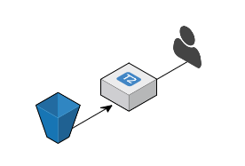
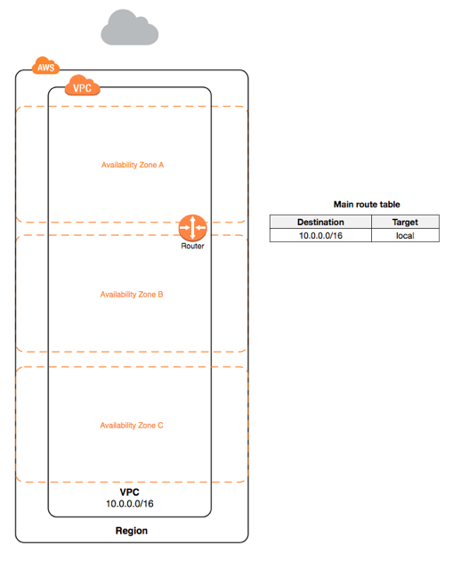
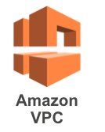
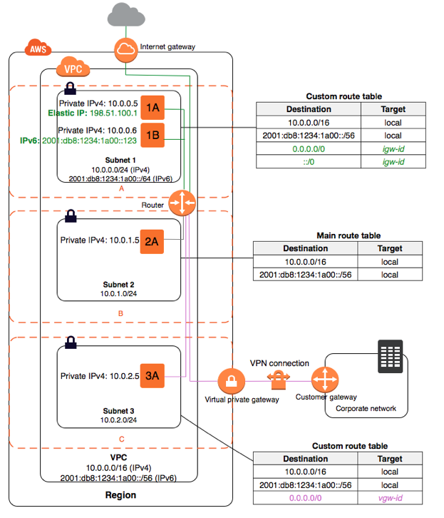
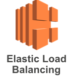
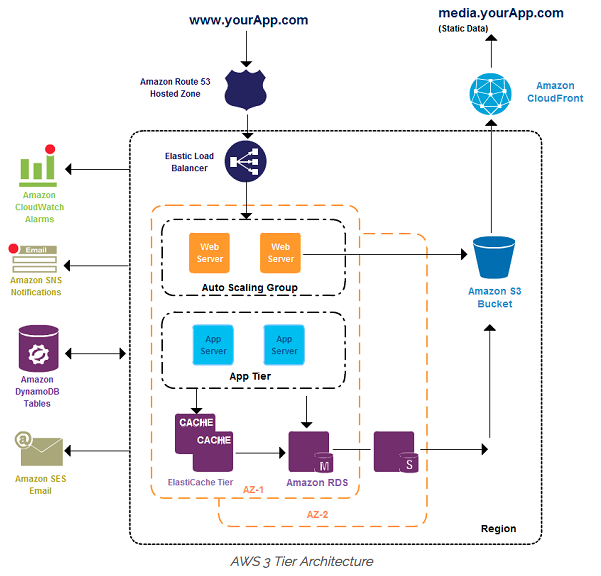
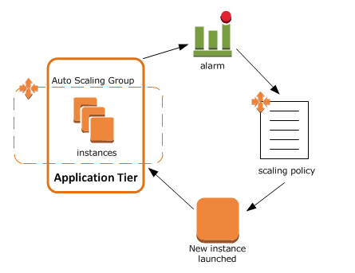

# AWS 기초 코스: 4교시 
## VPC, ELB, Auto Scaling
### CodeSquad

---
<!-- page_number: true -->
# EC2와 S3로 서비스 구성 

서버 1대가 다운된다면? 
S3도 다운될 수 있나요? 

---
# EC2와 S3로 고가용성 서비스 구성
- 로드 밸런서 필요 
- AZ는 다운될 수 있음 (AZ: 가용영역, 논리적 데이터 센터) 

- multi AZ를 활용한 고가용성 서비스 구성 필요

### VPC와 ELB를 이용하면 고가용성 서비스 구성 가능

---
# Amazon Virtual Private Cloud

---
# VPC
- 고객의 서비스를 위한 가상의 격리된 네트워크 망
- 같은 계정이라도 서로 다른 VPC간 통신은 기본적으로 단절되어 있음
- 리전별로 분리되어 있음
- 하나의 VPC는 여러 서브넷을 포함
- 한 계정에 여러 VPC 생성 가능 

---
# subnet 

---
# subnet
- ec2 인스턴스가 연결되는 네트워크
- VPC에 포함됨
- subnet 별로 라우팅 규칙을 별도로 정의 
- subnet은 반드시 하나의 AZ에 속함 

---
# ELB
- L4 또는 L7에 해당하는 로드 밸런서
- 애플리케이션 로드 밸런서와 클래식 로드 밸런서의 2 종류가 있음 
- 리전 서비스이므로 **복수의 AZ에 트래픽을 분산시키는 것이 가능함**
- auto scaling과 함께 사용하는 경우가 많음 

---
# Route53
- AWS의 DNS 서비스 
- 100% 가용성 보장 
- 인스턴스의 헬스 체크 기능 
- AWS 다른 서비스들과의 연동에 유리 

---
# 일반적인 웹 서비스 구성 예제 

http://creately.com/blog/announcements/aws-architecture-diagrams-icons/

---
# Auto Scaling 
- 서비스에 확장성을 줄 수 있게 하는 서비스 
- AWS의 대표적 인기 서비스 
- https://www.slideshare.net/serialxnet/kgc2013-1
- https://www.youtube.com/watch?v=PqqfCIzA-qs

---
# Auto Scaling의 원리 

---

# 강사 데모 
1. ELB 생성 및 테스트 

---
# 실습4 ELB 시작하기

