# CodeSquad AWS 중급 과정 실습 가이드

## 실습0. IAM을 이용한 계정 세팅

### 1. 실습 정보 확인하기
   강사의 안내를 참고하여 다음 정보를 확인한다.
 > AWS account number: 12자리 숫자로 되어 있음
 > AWS IAM id: 해당 계정에 접속하기 위한 IAM 사용자아이디
 > 패스워드: IAM 사용자의 패스워드
 > 접속링크: bit.ly로 시작하는 짧은 접속용 링크. 실제 링크 주소는 계정번호 12자리를 이용해서 아래처럼 생성된다.

   https://123456789012.signin.aws.amazon.com/console

### 2. AWS 계정에 로그인하기
1.   웹 브라우져를 열고 앞에서 제공한 접속링크 주소롤 접속한다. **AWS는 크롬 또는 파이어폭스만을 공식 지원한다**

2.   로그인 화면에서 1의 정보를 이용해 로그인한다. 계정 번호가 일치하는지를 확인하고 사용자 이름과 암호를 입력한 후 ‘로그인’ 버튼을 클릭한다. 

     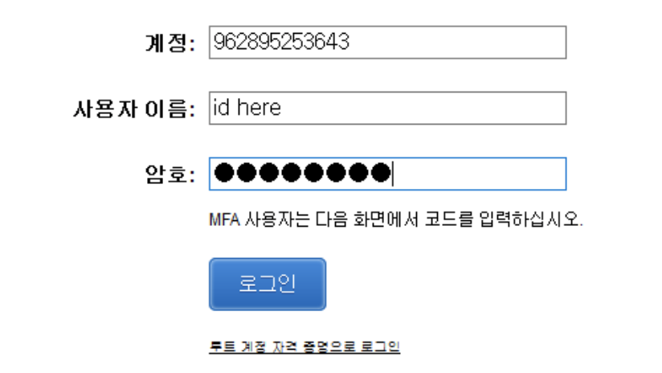

3.   로그인이 정상적으로 되었을 경우 오른쪽 상단에서 아래와 같은 화면을 확인할 수 있다.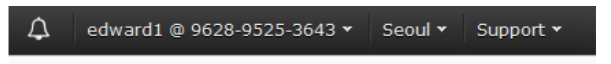

### 3. IAM 사용자 생성 및 권한 부여
1. 먼저 IAM을 이용해 현재 사용자의 권한을 확인한다.
Services 버튼을 눌러 서비스 메뉴가 나오게 한 후에 [Security, ..] 항목 아래에 있는 [IAM]을 선택한다. 
   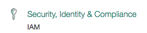

2. [Users] 를 누른 후 접속한 user의 아이디를 클릭하여 세부 권한을 확인한다. 현재 사용자는 IAM 권한만 가지고 있으며 다른 리소스를 생성 또는 접근할 수 있는 권한을 가지고 있지 않다. 
   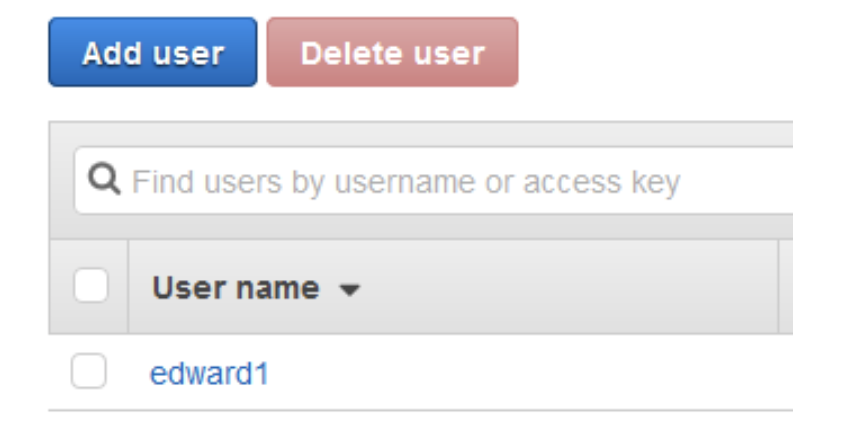
   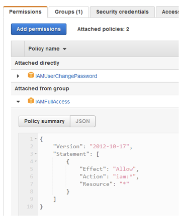

3. IAM Group 및 Group policy 확인
   각 계정에는 실습을 위한 students2 그룹이 생성되어 있고 실습을 위한 권한이 부여되어 있다. [Groups] – students2 를 선택하고 [permission] 탭을 클릭 어떤 policy 들이 부여되어 있는지 확인한다. 각각의 policy 를 클릭하면 json으로 policy 의 세부 내용도 확인할 수 있다.
   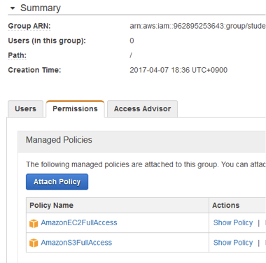

4. 새로운 IAM 사용자 생성하기
이후의 실습을 진행할 새로운 IAM 사용자를 생성한다. [Users] – [Add user] 를 클릭한다. 첫번째 단계인 [1 Details] 에서 아래와 같이 입력하고 `Next`를 누른다.

   > username: 사용할 id를 기입한다.
   >
   >  
Access type:  AWS Management Console access 체크박스를 체크
   >
   > 
Console password: Autogenerated password 선택

   >
   > Require password reset: 체크박스 해제

   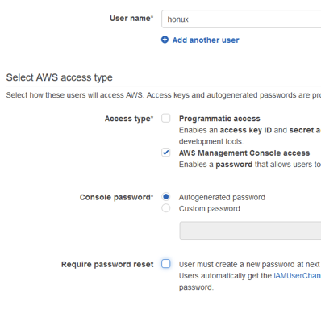

5.  [2 permissions] 단계에서 기본 선택인 [Add user to group] 항목에서 이미 만들어져 있는 **students2** 그룹을 선택한다. 화면을 아래로 내리고 [Next: Review]를 선택한다.
    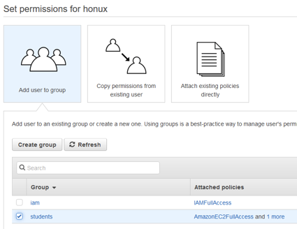
6.  실수가 없는지 검토한 후에 `Create user` 버튼을 눌러 사용자를 생성한다.
7.  `Download csv` 버튼을 눌러 개인정보를 다운받는다. `show` 버튼으로 생성된 패스워드를 확인할 수도 있다.

  

###  4. 새로운 사용자 로그인 및 사용자 권한 테스트

1. 왼쪽 상단의 [Services] – History 탭의 [IAM] 을 다시 클릭한다. History 탭은 최근에 사용했던 서비스들의 목록이 존재한다.  

   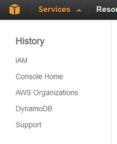

2. IAM 화면의 URL또는 처음 접속에 사용한 URL을 이용해 다시 로그인 화면으로 이동한다.
   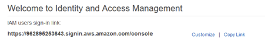  


3. 전단계에서 생성한 ID와 패스워드를 이용해 로그인한다. 


   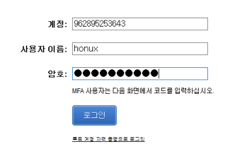

4. 새로운 사용자로 IAM 서비스를 클릭한다. 이 사용자는 IAM 사용 권한이 없으므로 아래와 같은 화면을 볼 수 있다. 관리자를 제외한 대부분의 사용자에게는 IAM 권한을 주지 않는 경우가 많다.

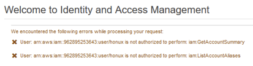  


5. [Services] – [S3]를 선택한다. [Create Bucket] 버튼을 누르고 버켓을 생성해 본다. 버켓 정보 입력 화면에서 다음과 같이 입력한다.


   > Bucket name: 적당히 unique한 이름 선택. _와 같은 특수문자는 입력이 안 되는 경우가 많으므로 주의
   >
   >  
Region: 본인의 실습용 리전 선택
   >
   > 
Copy settings from .. : 공란으로 비워 둠 

   입력을 마친 후에는 **왼쪽 하단** 의 `Create` 를 클릭 버켓 생성을 해 본다. 

#### 수고하셨습니다. 실습 1 IAM 사용자 생성 실습을 완료했습니다. 실습 1에서 생성한 계정 정보는 이후의 실습에서도 사용되니 잘 보관하시기 바랍니다.

