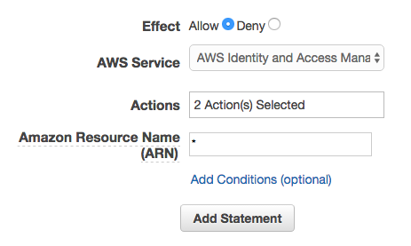

# CodeSquad AWS 중급 과정 실습 가이드

## 실습2. IAM Role 테스트


### 1. 사용자용 Access Key 및 Secret Key 생성 
1. AWS IAM 권한이 있는 계정을 이용해서 AWS관리 콘솔에 로그인한다.

2. Services - IAM 클릭 

3. Users - 실습0에서 생성한 사용자 아이디 클릭 

4. Summary - Security credentials 탭 클릭

5. Create access key 선택 

6. `Download .csv file`을 선택 Access Key ID와 Secret access key정보를 저장한다. 

### 2. NAT 인스턴스 로그인 및 CLI 테스트  

1. 실습 1에서 생성했던 NAT 인스턴스에 로그인한다. 

2. 터미널에서 다음 명령을 입력해 EC2의 상태를 본다. 권한이 없음을 알 수 있다. 

   ```
   $ aws ec2 describe-instances --region ap-northeast-1
   ```

3. 아래 명령을 입력하고 1에서 생성한 값들을 입력한다. 
   디폴트 리전 네임은 다음 링크를 참조해서 입력한다. 

   > 예) 버지니아: us-east-1
   >
   > 서울: ap-northeast-2
   >
   > 뭄바이: ap-south-1

   http://docs.aws.amazon.com/general/latest/gr/rande.html 

   ```Bash
   $ aws configure
   AWS Access Key ID : access key 입력
   AWS Secret Access Key: secret access key 입력
   Default region name: 본인의 리전 입력
   Default output format: json    
   ```
4. 다시 2의 명령을 실행해 본다. 정상적으로 실행되는 것을 확인할 수 있다. 
```
$ aws ec2 describe-instances 
```
5. 내 인스턴스의 정보만을 보려면 다음과 같이 할 수 있다. 
```Bash
$ instance=$(curl -s -w '\n' 169.254.169.254/latest/meta-data/instance-id)
$ echo $instance
$ aws ec2 describe-instances --instance-ids $instance --query Reservations[0].Instances[0] --output table
```
또는 간편하게 아래의 명령으로도 가능하다. 
```
$ curl -L http://public.codesquad.kr/scripts/myinstance.sh | sh
```
### 3. 사용자에게 EC2 Role 접근 권한 부여하기  
위 2번의 방법을 이용하면 IAM 사용자로 인증을 받아서 CLI도 사용자와 동일한 권한을 가지게 된다. 하지만 위의 방법은 access key와 secret key가 노출될 위험을 가지고 있으므로 보안상 조금 더 안전한 EC2 Role을 사용해 본다. 

1. IAM 권한이 있는 계정으로 관리 콘솔에 로그인한다.
2. IAM - Users - 사용자아이디 클릭 
3. Permissions 탭의 `+Add inline policy` 선택. 우측 하단에 있다.
4. Policy Generator `Select` 클릭 
5. Edit Permissions 에서 다음 내용 선택 후 `Add Statement` 클릭 
> AWS Service: AWS Identity and Access Management
> Actions: ListInstanceProfiles 와 PassRole 두 개의 체크박스 선택
> ARN: * 


6.`Add Statement`클릭 

7.`Next Step` 클릭
8.`Apply Policy` 클릭

### 4. 사용자 권한 테스트 해보기 
1. Services - IAM 클릭, 화면의 오른쪽 하단의 Policy Simulator 클릭 
2. 왼쪽에서 본인아이디 선택
3. 오른쪽의 Policy Simulator 아래의 선택 메뉴에서 순서대로
> AWS Identity and Access Management 선택
> Select All 클릭
> Run Simulation 클릭
4. 잠시 후에 허용한 두 API (PassRole, ListInstanceProfiles) 를 제외한 나머지 API는  deny 된 것을 확인할 수 있다. 

### 5. EC2 인스턴스에 role 부여하기
1. 다시 NAT 인스턴스에 접속하고 아래 명령을 입력한다. 인증 정보가 사라져서 다시 CLI 명령이 거부되는 것을 확인할 수 있다. 
```
$ rm ~/.aws/credentials
$ aws ec2 describe-instances 
```
2. AWS 관리 콘솔에 본인의 계정(실습 0에서 생성한) 으로 로그인한다. 
3. Services - EC2 - Instances 클릭
4. 실습1에서 생성한 EC2 인스턴스를 선택한다. 
5. Actions - Instance Settings - Attach/Replace IAM role 선택
6. 기존에는 볼 수 없었던 EC2 Role이 3단계에서 허용했기 때문에 보인다. lab-power role을 선택하고 'Apply'를 누른다. 
7. NAT 인스턴스에 접속하고 아래 명령을 입력한다. 다시 정상적으로 동작하는 것을 알 수 있다. 
```
$ curl -s -w '\n' 169.254.169.254/latest/meta-data/iam/info
$ aws ec2 desribe-instances 
```

### 도전 과제 
관리 콘솔에서 switch role을 이용해 보자. 
CLI에서 iam role을 사용해 보자. 
### 수고하셨습니다. 실습2를 완료하셨습니다. 


