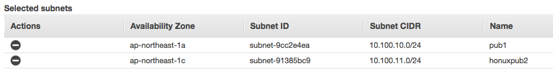
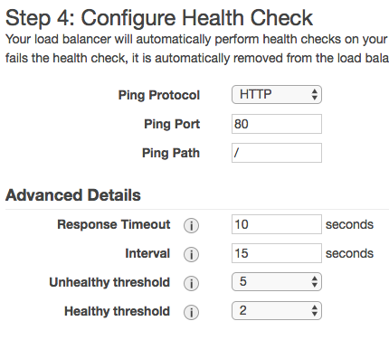
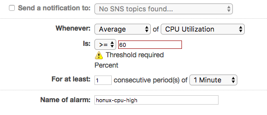
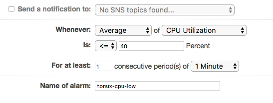
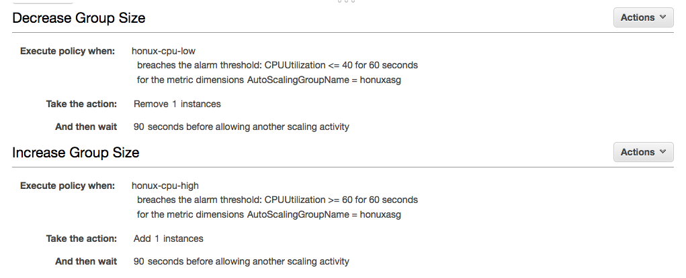

# CodeSquad AWS 중급 과정 실습 가이드

## 실습3. Auto Scaling 구성 


### 1. AWS 콘솔에 로그인 
1. 실습 0에서 생성한 사용자 아이디를 이용해서 AWS관리 콘솔에 로그인한다.


### 2. public subnet 추가하기  

1. 실습1에서 생성한 사용자VPC에 public subnet을 추가 생성한다. 
> subnet 이름: 아이디pub2
> AZ: 두번째 AZ 선택
> CIDR 주소: 10.100.11.0/24
2. 생성후 **라우팅 테이블 탭에서 `Edit`클릭 public routing table과 연결해야 한다. **

### 3. ELB용 보안그룹 생성 
1. Services- EC2 - Security Groups 선택 , Create Security Group 클릭
2. 아래와 같이 입력
> name: 아이디elbsg
> Description: 아이디 elb sg
> vpc:아이디vpc
> Inbound: Add Rule 클릭 후 HTTP 선택
> `Create`클릭
3. 위와 같은 방법으로 아이디websg 추가 생성, 규칙은 동일하게 생성한다. 

### 4. ELB 생성 
1. EC2 - Load Balancers 선택
2. Create Load Balancer 클릭
3. Classic Load Balancer 선택, Continue 클릭
4. 다음과 같이 입력
> Load Balancer name: 아이디elb
> Create LB Inside: 아이디vpc 선택

** Internal load balancer에는 체크하지 않는다!! **
5. Select Subnets 이 생기면 2개의 public subent 옆에 있는 + 단추를 클릭한다. 
   
6. 보안 그룹 선택: elbsg 선택, next 두 번 클릭, Step 4로 
7. Step 4에서 아래와 같이 값 입력 
   
8. Step 5에서는 인스턴스를 선택하지 않는다. 
9. 계속 Next 등을 눌러 Close까지 클릭. 


### 5. 시작 구성 생성 
1. EC2.- Launch Configurations 선택 
2. Create Auto Scaling Group 클릭
3. Create launch configuration 클릭
4. Amazon Linux  - t2.micro 선택, next 클릭
5. 아래와 같이 입력 
> Name: 아이디LC
> Monitoring: Enable Cloudwatch ... 체크박스 체크
6. Advanced Details 클릭 
7. User data 아래와 같이 입력. ** script.txt에서 붙여 넣는다 ** 
```
#!/bin/sh
yum -y install httpd php mysql php-mysql
chkconfig httpd on
/etc/init.d/httpd start
cd /tmp
wget http://public.codesquad.kr/files/asg-web.zip
unzip asg-web.zip
mv asg-web/* /var/www/html
```
> IP Address: Assign a public IP address to every instances 체크 

8. Next: Add Storage 클릭
9. Next: Configure security group 클릭, select an existing security group 체크후 web sg. 선택, continue 클릭
10. Create launch configuration 클릭, 전단계에서 생성한 키페이 선택
11. 시작 구성 생성을 완료한다. 

### 6. Auto Scaling Group 생성
1. 이어서 ASG 생성을 계속한다. 
> name: 아이디asg
> Network: 아이디vpc
> Subnet: 퍼블릭 서브넷 2 추가 

2. Advanced Details 클릭 아래와 같이 선택후 next 클릭
> Receive traffic from load balancer 체크 
> Classic Load Balancers: 아이디elb 선택

3. Use scaling polices 선택 , Scale betwwen 1 and 4 instances 선택 
4. Increate Group Size 에서 Add new alarm 선택, 이후 대화상자에서 아래처림 입력후 Create Alarm 선택
> Send a notification checkbox 해제
> Is >= 60 
> For at : 1, 1 Minutes 선택 
> Name of alarm: 아이디-cpu-high 선택



5. Create a simple scaling policy 클릭, Add 1 instances 입력한다. And then wait 값은 90으로 수정한다.  

6. 같은 방식으로 Decrease Group Size 입력 
   



7. next 등을 눌러 생성 완료

### 7. activity history 관찰 

1. Auto Scaling Groups의 아이디asg 선택, 아래쪽의 Activity History를 주기적으로 관찰 
2. 인스턴스 생성후 ELB의 주소로 웹 브라우져 접속
3. `generate load`를 클릭한다. 
4. 1 ~ 2 분이 지난 후에 인스턴스가 추가로 생성되는지 확인한다. 
5. 생성 후 잠시 더 기다리면 인스턴스가 자동으로 종료되는지도 확인한다. 

### 수고하셨습니다. 실습 3을 완료하셨습니다. 


