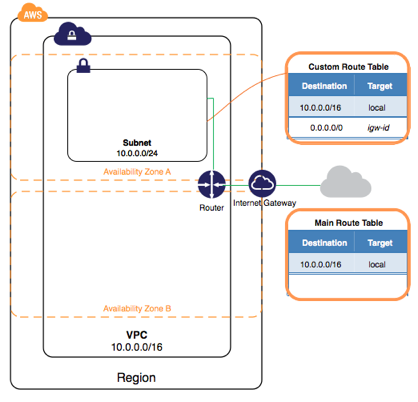
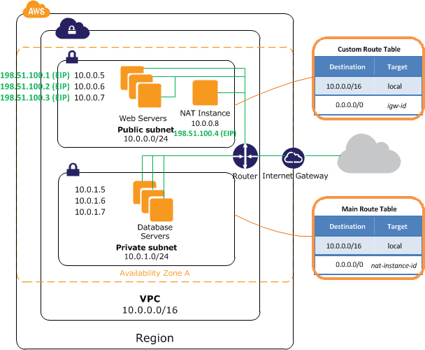
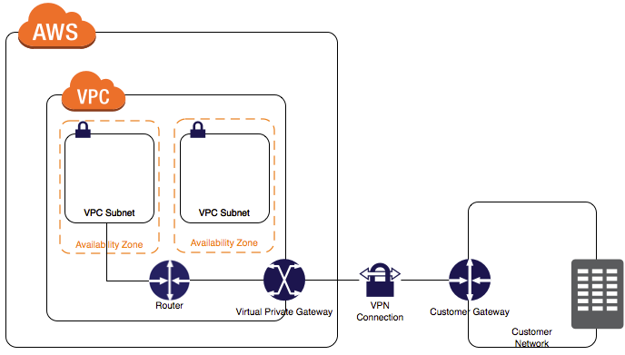
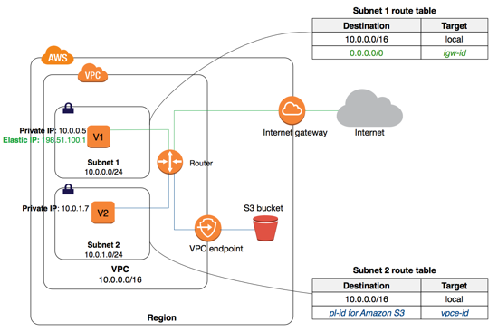

# AWS 중급 코스: 1교시 
## VPC, subnet, 보안그룹 
### CodeSquad

---
<!-- page_number: true -->
# VPC: Amazon Virtual Private Cloud
- 사용자 전용의 가상 네트워크 
- 다른 사용자 네트워크와 논리적으로 완전히 분리됨 
- EC2와 같은 여러 AWS 서비스 리소스를 VPC 내에서 실행함 
- VPC를 더 작은 범위의 subnet으로 나눌 수 있음 
https://aws.amazon.com/ko/documentation/vpc/

---
# EC2 classic
- VPC가 생기기전 사용하던 단일 네트워크 망
- 2013년 12월 4일 이후에 만든 계정에서는 사용할 수 없음
- VPC에 비해 성능 / 보안상 좋지 않으므로 migration 권장 

---
# Default VPC
- 사용자가 루트 계정을 생성하면 자동으로 각 리전당 하나씩 VPC가 생김
- EC2의 경우 VPC를 지정하지 않을 경우 기본 VPC에서 인스턴스가 시작됨 
- 기본 VPC도 삭제 가능
- 사용자가 생성할 수는 없음 (Support 이용)

---
# VPC의 특징
- 리전 기반 서비스 
    - subnet, ec2, eni: AZ 기반 서비스
- 최초 생성시 외부 통신은 완벽히 차단됨
    - 인터넷 게이트웨이
    - VPC 피어링 
    - VPG 연결
    - VPC Service Endpoint 
- VPC 내부에 subnet을 가질 수 있음 
---
# VPC 만들기 
- 리전 선택: VPC는 리전 서비스
- VPC 생성
    - CIDR 지정: VPC에서 사용할 사설 IP 지정 
    - VPC 이름: 구분하기 좋은 명확한 이름
- 인터넷 게이트웨이 생성 및 VPC에 연결 

---
# CIDR (사이더) 표기법 
- Classless Inter-Domain Routing
- subnet과 함께 클래스 기반 주소의 한계를 극복하고 IP를 분류 및 그루핑하기 위해 개발됨 
> xxx.xxx.xxx.xxx/n
> xxx: IPv4 
- 상위 n 비트: 네트워크 인식
- 하위 n 비트: 호스트 인식
- 상위 n 비트는 고정, 하위 비트는 가변적
- 하위 비트의 값은 0을 가져야 함 

 https://en.wikipedia.org/wiki/Classless_Inter-Domain_Routing
http://docs.cloud.toast.com/ko/Infrastructure/Compute/CIDR%20Guide/

---
# CIDR 예제
> 56.3.26.84/32 - IP 1 개
> 0.0.0.0/0 - any address
> 10.1.0.0/16 - 65536
> 10.1.1.0/24 - 256
> 10.1.16.0/20 - 2048

---
## AWS CIDR 규칙
- vpc: 16 ~ 28 bit prefix 
- subnet: vpc의 부분집합으로 지정 가능
- subnet 사용가능 IP: 전체 범위 - 5
- aws에서 앞4, 마지막 1주소를 사용함 

---
# subnet 
- 서브넷은 반드시 한 AZ에 속해야 함
- 서브넷은 반드시 하나의 Routing 테이블과 연결되어야 함 
- EC2 등의 서비스는 서브넷에 연결됨 
- 서브넷은 VPC CIDR의 부분집합
- 같은 VPC 내의 서브넷끼리 CIDR 중첩 불가 
- 서브넷마다 고유한 NACL을 가짐 
- 
---
# Routing 테이블
- 서브넷에서 트래픽 플로우에 대한 규칙 지정 
- Destination 및 target 지정
- VPC 생성시에는 기본 Route table이 생성됨
- 추가로 라우팅 테이블을 생성해서 subnet에 할 가능

---
# Routing 대상
- 인터넷 게이트웨이
- VGW
- NAT Gatewy
- NAT Instance
- VPC peering 

| Destination | Target |
| ----------- | ------ |
| 10.0.0.0/16 | local  |
| 0.0.0.0/0   | IGW    | 

---
# Routing 우선순위
- 라우팅 테이블 규칙 중 **트래픽과 일치하는 가장 구체적인 라우팅을 사용해 트래픽의 라우팅 방법을 결정**

---
# public subnet 
- 인터넷으로 연결되는 서브넷 
- **subnet은 기본적으로 동일하나 라우팅 테이블에 의해 기능이 구분됨**

---
# 작성후의 모습

---
# private subnet 
- 인터넷으로부터의 직접 액세스가 불가능
- nat 인스턴스 또는 nat gateway를 통해 간접적으로 인터넷 가능

---
# NAT 인스턴스를 생성하려면 
- 보안그룹 설정 확인
- 내부 방화벽 규칙 변경 (IP masquarade)
- EC2 인스턴스 SrcDestCheck 비활성화

# NAT 인스턴스 사용하기
- private subnet의 라우팅 테이블 규칙 수정

---
# 작성후

---
# 보안 서브넷
- VPN 전용 서브넷이라고도 함 
- 인터넷 망과 완벽하게 분리됨
- 주로 민감 정보 저장용으로 사용
- 인터넷망과의 통신은 VPN을 이용해서 연결 

---
# VPC Peering 
- 같은 리전의 VPC끼리 직접 연결
- 다른 계정의 VPC와도 연결 가능 
- 쉽고 간단

1. peering 연결 생성
2. 라우팅 테이블 수정 
3. 연결 테스트 

---
# VPC Peering 주의사항
A - peering - B 
B - peering - C
라도 A - C는 서로간에 통신 불가 

---
# AWS VPN 구성 
- AWS hardware VPN
- AWS Direct Connect
- AWS VPN CloudHub
- 소프트웨어 VPN
- 기타 

---

---
# VPC 보안
- Best Practice: 라우팅 테이블, NACL, 보안그룹 모두를 사용하는 것이 좋다. 

---
# NACL
- 서브넷의 트래픽을 allow / deny 할 수 있음
- 간단한 규칙은 NACL을 통해
# 보안그룹 
- 인스턴스의 inbound/outbound 트래픽 제어에 사용 
- 기존 방화벽과 유사한 용도 

---
| NACL     | 보안그룹    |
| -------- | ------- |
| - 상태 비저장 | - 상태 저장 |
| - 순서대로 평가 | - 한꺼번에 평가 |
| - 상태 비저장 | - 상태 저장 |
| - 상태 비저장 | - 상태 저장 |

---
# VPC S3 endpoint 
- Why?

---
# VPC 운영 
- 서비스별로 따로 운영
- 테스트 환경별로 따로 운영 
- 기능별로 VPC를 나눠면 어떨까요?
    - 웹서버 VPC, 디비 VPC, ...

---
# 실습 1
- VPC 실습 
---
# 참고자료 
http://www.e-infomax.com/ipmasq/howto-trans/kr/IP-Masquerade-HOWTO-2.html