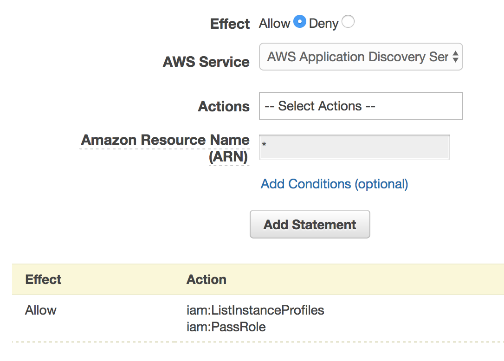

# AWS 중급 코스: 2교시 
## IAM, IAM Policy, IAM Role 
### CodeSquad

---
<!-- page_number: true -->
# IAM: Identity and Access Management  
- AWS 리소스에 대한 액세스를 안전하게 제어할 수 있는 웹 서비스 

--- 
# AWS를 사용하는 방법
1. HTTP REST / SOAP API
2. 관리 콘솔
3. CLI
4. SDK
5. Visual Studio / Eclipse

모두 사용자 인증이 필요 

---
# AWS를 인증하는 법
- id, password 기반 인증
    - 관리 콘솔에서 사용
- access key / secret key 기반 
    - 나머지 전부 
- 임시 자격 증명도 사용 가능
- LDAP/ oauth 등을 이용한 연동도 가능 


---
# access key와 secret key는 어디서? 
- IAM console에서 사용자 별로 생성가능 
- 최대 계정당 2개, why?
- STS(Security Token Service)를 이용해서도 임시로도 생성 가능 

---
# IAM Policy 
- AWS 리소스 접근 권한을 지정할 때 사용
- JSON 포맷을 사용
- **사용자, 그룹, IAM Role**에 attach해서 사용

http://docs.aws.amazon.com/ko_kr/IAM/latest/UserGuide/reference_policies_elements.html

---
# IAM Policy의 유형
## Managed Policy
- AWS managed policy
- Customer managed policy
## Inline Policy
- 1회용 정책, 재사용 불가 
- 연결된 사용자 외에는 사용 불가 
- 삭제 후 재사용 불가

---
# IAM Policy
```json
{
  "Version":"2012-10-17",
  "Statement":[
    {
      "Sid":"AddPerm",
      "Effect":"Allow",
      "Action":["s3:GetObject"],
      "Resource":["arn:aws:s3:::examplebucket/*"]
    }
  ]
}
```
---
# IAM Policy format 
```
{
"Version":"2012-10-17", 
"Statement":[{...},{...},{...}]
}
```

---
# Statement
- Effect: Allow / Deny 가능
- Action: 허용할 API의 집합
- NotAction: 해당 API만 제외하고 허용
- Resource: ARN 규칙을 이용한 리소스 표기 방식
- Condition: 세부적으로 권한 조정을 위한 condition 

---
# ARN: Amazon Resource Name 
AWS에서 리소스를 고유하게 식별하기 위한 규칙 
> arn:aws:service:region:account-id:resource
> arn:aws:service:region:account-id:resourcetype/resource
> arn:aws:service:region:account-id:resourcetype:resource

---
# ARN 예제
> arn:aws:dynamodb:ap-northeast-2:123456780912:table/user
> arn:aws:ec2:us-east-1:123456789012:volume/vol-1a2b3c4d

---
# IAM Policy 만들기
- 직접 생성
- 기존 정책으로부터 만들기
- Policy Generator로부터 만들기 

---
# Example


---
# Example

```
{
    "Version": "2012-10-17",
    "Statement": [
        {
            "Sid": "Stmt1492435209000",
            "Effect": "Allow",
            "Action": [
                "iam:ListInstanceProfiles",
                "iam:PassRole"
            ],
            "Resource": [
                "*"
            ]
        }
    ]
}
```
---
# IAM Role
- Policy를 붙일 수 있음
- 인증 방법은 없음
- 사용자 / 그룹 / 기타 객체들이 사용 가능 
- 임시 자격 증명 
- STS와의 연동으로 사용 가능 

---
# 사용 사례 
- 다른 팀원에게 일시적으로 권한을 줄 경우
- EC2 인스턴스가 AWS 리소스에 접근할 경우
- 안드로이드 앱이 AWS 리소스에 접근할 경우


---
# IAM Best Practice
- 권한을 줄까 말까 망설여지면? 주지 마라.
- 1인당 1계정
- CloudTrail을 이용해 감시할 것 
- Root 계정은 일반 용도로 사용하지 말 것
- Access Key / Secret Key 유출 주의 

--- 
# Demo 
IAM Role 사용 
EC2 Role 붙이기 
관리 콘솔 Switch Role 
https://web-identity-federation-playground.s3.amazonaws.com/index.html

--- 
# 실습 
EC2 Command Host 구축 
EC2 Role 사용해 보기 

