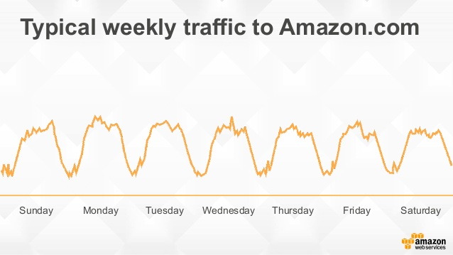
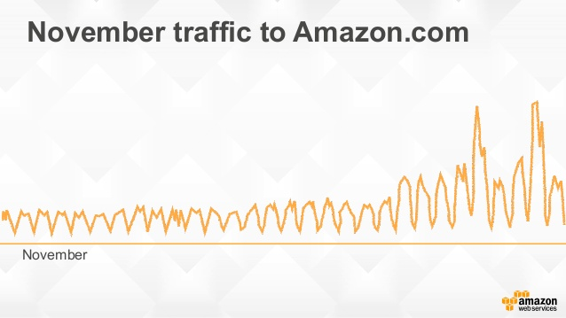
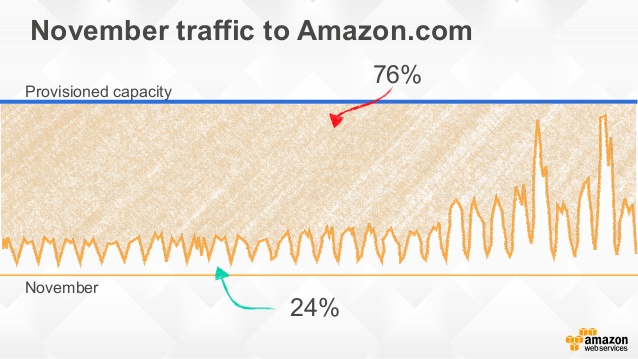
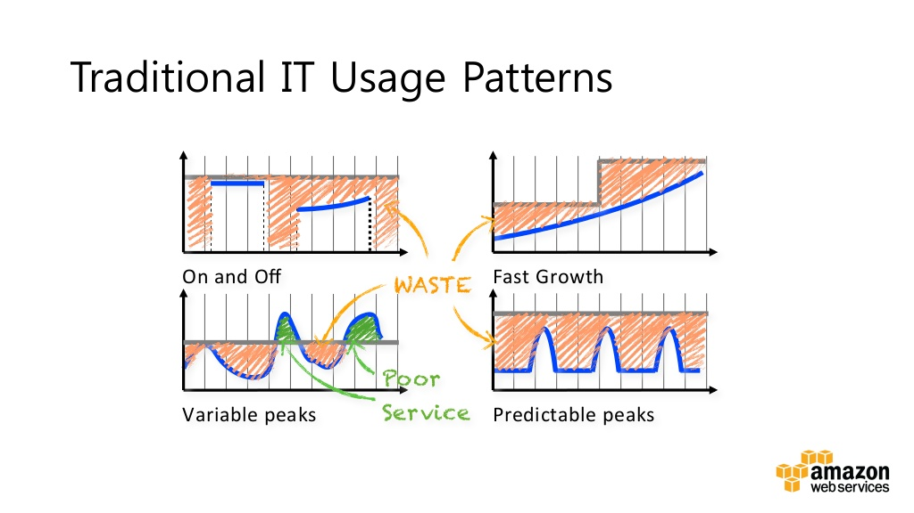
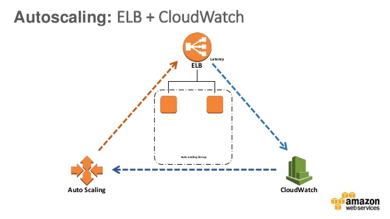
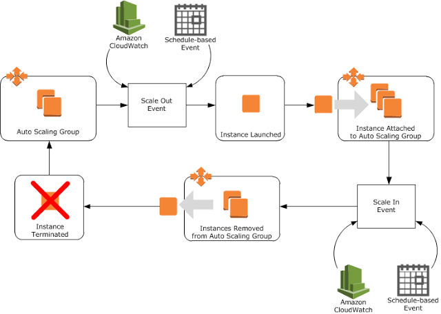

# AWS 중급 코스: 3교시 
## Auto Scaling
### CodeSquad

---
<!-- page_number: true -->
# Amazon 평소 트래픽

---
# 블랙데이 때의 트래픽 

---
# 낭비되는 곳 

---

---
# 국내 사례
- 쿠키런
- 디스패치 
- 기타등등

---

---
# Auto Scaling 구성요소와 원리 

---

---
# Amazon CloudWath
AWS 리소스를 모니터링
기본으로 제공해 주는 메트릭
직접 생성할 수 있는 custom metric

---
# ELB 
EC2와 연결해서 사용하는 로드 밸런서
사용자의 트래픽을 멀티AZ의 인스턴스들에게 분산
L4, L7 두 종류가 있음
ACM 서비스를 통해 무료 인증서 발급 및 연결이 가능해졌음 

---
# Auto Scaling 시작하기 단계
1. 시작 구성 생성
2. Auto Scaling 그룹 생성
3. Auto Scaling 그룹 확인

---
# Launch Configuration (시작 구성)
- 시작 구성의 내용으로 EC2 인스턴스가 자동 생성됨 
- UI는 기본 EC2 생성과 거의 유사 
- ASG는 반드시 하나의 시작 구성을 가지고 있어야 함
- ASG가 돌아가고 있는 동안 시작 구성 교체가 가능함

---
# Launch Configuraton 설정
- 이름
- AMI
- 인스턴스 유형
- user data
- 보안 그룹 
- ...

**Launch Configuration은 생성후 수정이 불가능함**

---
# Auto Scaling Group 구성
- 이름
- 사용할 **시작 구성**
- min / max instance 수
- VPC와 AZ
- ELB 사용 여부 
- Scaling Policy 

---
# ASG의 인스턴스 숫자 조정
## 동적으로 조정
Scaling Policy

## 수동으로 조정
Desired Capacity

## 일정에 따라 조정
Scheduled Action

---
# 인스턴스 생성 및 삭제 규칙
- 생성은 어떻게?
- 삭제는 누구부터?

---
# ELB Sticky Session  
    
# Loose Couping HOWTO
- ElastiCache, DynamoDB
- Session Clustering 

---
# 참고자료 
https://www.slideshare.net/AmazonWebServices/all-you-need-to-know-about-auto-scaling-popup-loft

http://technologyandarchitecture.blogspot.kr/2015/08/amazon-web-services-auto-scaling-and.html

https://www.slideshare.net/awskorea/kr-webinar-2015-autoscaling-masterclass
