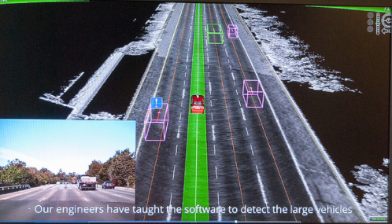
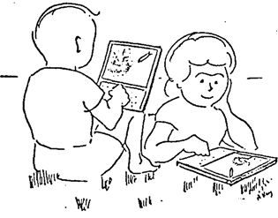
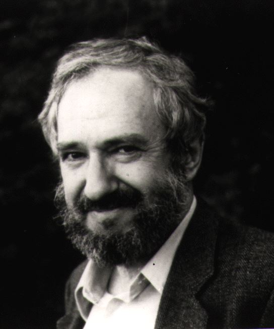

# 세상을 바꾸는 소프트웨어 기술
## 사람을 바꾸는 소프트웨어 교육 

코드스쿼드 마스터  
정호영

---
<!-- page_number: true -->
# 세상을 바꾸는 여러가지 소프트웨어 기술들 

- 딥러닝과 AI
- 빅데이터 
- 클라우드
- 그 외 다양한 SW 기술들 

---
# 실제 적용 사례

- 자율주행 
- 무인드론 택빼
- 무인상점  
- 개인비서 
- 에어컨디셔닝 최적화
- 챗봇
- 고품질 번역기 

---
# 자율주행 

- https://www.flickr.com/photos/eggplant/15426339858

---
# 아마존 물류센터

---
# 아마존 물류센터 
- https://youtu.be/UtBa9yVZBJM
> CNET News - Meet the robots making Amazon even faster
- 물류센터 노동자들의 가혹한 근무환경 개선을 위해 만들어짐
- 인공지능 및 빅데이터 기술 적용
- 미리 동선을 파악해서 예상 위치로 이동 

---
# 아마존 무인 드론

---
# 아마존 무인 드론
> Amazon Prime Air’s First Customer Delivery
- https://youtu.be/vNySOrI2Ny8
- 이미 베타테스트 시작 중
- 인구가 많지 않은 농촌지역 등에 적합

---
# 그 외 사례들
## MS 코타나
## 구글 번역기와 네이버 파파고
## Lip Reading 
## Vougue 데이터센터 
---
# 미래에는
## 소프트웨어 및 과학기술로 인해
- 생산성이 매우 높아짐
- 불치병의 정복과 급격한 수명의 증가 
- 인간의 노동이 필요한 분야가 줄어듬
- 현재와는 다른 고용 형태가 될 것
- 학력, 지식의 효용성 저하 
## 근미래에는 소프트웨어 엔지니어가 부족할 것으로 예상

---
# 소프트웨어 교육

- 초창기 mac에서 구동되던 포격 게임 
- 꽤 복잡한 연산이 필요하다
- 코딩 교육을 통해 구현 가능 (초등 4학년 수준)

---
# 다양한 소프트웨어 교육 사이트들
- https://code.org/
- https://scratch.mit.edu/
- https://www.tynker.com/
- https://www.madewithcode.com/
- https://codecombat.com/
## 진짜 많다.

---
# 국내 교육 사이트들 
- 엔트리
- 코딩 클럽
- 대디스랩
- 기타 등등
## 역시 많아지고 있다.

---
# 무엇을 어떻게 선택해야 할까?
왜 소프트웨어 교육이 필요한지에 대해서부터 생각해 볼까요?

## 대학을 가기 위해
## 취업이 잘 된다고 하니까 
## 의무교육이라서
## 다른 이유는 없을까요? 

---
# 새로운 교육?
- 사실은 옛날에도 있었습니다.
- 다이나북 이야기

> A Personal Computer for Children of All Ages
> Alan C.Kay 
> http://it.donga.com/22351/

- 어린이들의 사고 형성을 도와 집단지성에 이바지함 

---
# Computatinal Thinking 
## 정보과학적 사고
> Mindstorms: Children, Computers, And Powerful Ideas
> Seymour Papert (1980)

> Computational Thinking
> Jeannette M. Wing (2006)

---
# Computational Thinking
> Computational Thinking (CT) is the thought processes involved in formulating a problem and expressing its solution(s) in such a way that a computer—human or machine—can effectively carry out.
> Computational Thinking is an iterative process based on three stages: 
> 1) Problem Formulation (abstraction),
> 2) Solution Expression (automation)
> 3) Solution Execution & Evaluation (analyses) 
- 문제해결 능력 
- 단순 컴퓨터에만 적용되는 것은 아님

---
# 그 외 이야기
- 오바마, 쥬커버그, 빌게이츠도 SW 교육을 강력 추천 
- 미국의 3대 인기 직종: 의사, 변호사, SW 엔지니어 
- 앞으로 일자리가 많이 생길 예정
- 우리가 워드를 쓰는 것처럼 미래에는 코딩이 일반화됨 

---
## 어떻게 공부하는 것이 좋을까?
- 의무교육, 학원, 과외, 독학, ...
## 어떤 언어로 공부할 것인가?
- 스크래치, 자바스크립트, 파이썬, 자바, C#, ...

## 무엇을 위해 공부할 것인가?
- 올림피아드, 대학입시 포트폴리오, 메이커, ... 

---
# 
## Seymour Parpet
 
(MIT 미디어랩 제공)

http://www.papert.org/works.html
http://www.sonoma.edu/users/l/luvisi/logo/logo.memos.html

