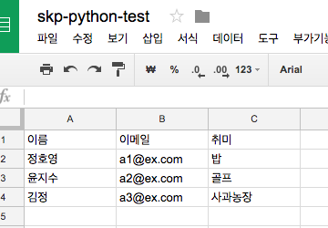
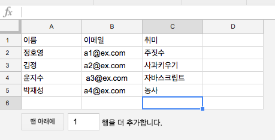

# 
# Python Basic
## 8. 생활 코딩 
CodeSquad

---
<!-- page_number: true -->
# google spreadsheet 사용해 보기 

## API 등록

https://console.developers.google.com 

1. 프로젝트가 없을 경우 신규로 생성한다.

2. Drive API 및 Sheet API를 활성화한다.

3. 사용자 인증 정보 - 사용자 인증 정보 만들기 옆의 삼각형 클릭 - `사용자 인증 정보 선택 도움말`로 인증 정보를 만든다. 

    - API: Google Drive API
    - 호출 위치: 기타 (CLI) 선택
    - 데이터: 어플리케이션 데이터 선택

4.JSON 파일을 다운로드한다.

---
## JSON 파일에서 이메일 주소 확인 

>"client_email": "honux-test@abcd-xxxxx.iam.gserviceaccount.com",

---
## 구글 스프레드시트 생성

1. 적당한 이름으로 최상위 폴더에 생성
2. **1행에는 셀 목차 지정**
3. 적당한 데이터 입력
4. `공유` 클릭 JSON의 이메일 주소로 접근 권한 지정 



---
## package 설치

> pip3 install gspread oauth2client
> 
---
## 샘플 코드 
<pre style="font-size:.7em;">
import gspread
from oauth2client.service_account import ServiceAccountCredentials

# use creds to create a client to interact with the Google Drive API
scope = ['https://spreadsheets.google.com/feeds']
credential = ServiceAccountCredentials.from_json_keyfile_name(
    'credentials/honux_google_id.json', scope)
client = gspread.authorize(credential)

# Find a workbook by name and open the first sheet
# Make sure you use the right name here.
sheet = client.open("skp-python-test").sheet1

# Extract and print all of the values
list_of_hashes = sheet.get_all_records()
print(list_of_hashes)
</pre>

---
## 간단 조작 
> sheet.row_values(1)
> sheet.col_values(1)
> sheet.cell(2, 1).value 

## 셀 업데이트 
> sheet.update_cell(2,2, "Python update")

## 행 추가 
> row = ['crong', 'crong@cs.com', '뽀로로']
> sheet.insert_row(row, 5)


## 행 삭제
> sheet.delete_row(1) # 오래 걸림, 비추(?)

---
# 프로그래밍 연습 

1.다음 내용을 받아서 출력하고 pikcle로 저장해 봅시다.
2.스프레드시트 내용을 지우고 pickle로부터 복원해 봅시다. 




---
# 참고 
http://gspread.readthedocs.io/en/latest/

https://www.twilio.com/blog/2017/02/an-easy-way-to-read-and-write-to-a-google-spreadsheet-in-python.html

---
# 이메일 보내기

## 구글 보안 설정 변경 
https://myaccount.google.com/lesssecureapps 에서 보안 수준이 낮은 앱 허용: 사용으로 변경 

- 가끔 원래대로 돌아갈 수 있으니 확인할 것 

---
# 간단 메일 전송 코드 
<pre style="font-size:.6em;">
import smtplib
from email.mime.multipart import MIMEMultipart
from email.mime.text import MIMEText

sender = 'honux77@gmail.com'
receiver = 'honux@codesquad.kr'

body = """\
테스트용 이메일입니다.
모두 행복한 하루 보내세요.
"""

msg = MIMEMultipart('alternative')
msg['From'] = sender
msg['To'] = receiver
msg['Subject'] = "코드스쿼드 학습메일"
msg.attach(MIMEText(body, 'plain', 'utf-8'))


gmail_user = "honux77@gmail.com"
gmail_pwd = "mypassword"
server = smtplib.SMTP('smtp.gmail.com', 587)
server.ehlo()
server.starttls()
server.login(gmail_user, gmail_pwd)
server.send_message(msg)
print("Successfully sent email")
</pre>


---
# 복수 메일 보내기 
```
receiver = ['honux@codesquad.kr', 'honux77@gmail.com']
# ...
msg['To'] = ",".join(receiver)

```

# HTML 메일 보내기 
```
body="""\
<h1>테스트용 이메일입니다.</h1>

"""
# ...
msg.attach(MIMEText(body, 'html', 'utf-8'))

```

---
# 파일 첨부하기 

<pre style="font-size:.9em;">
import smtplib
import os
from email import encoders
from email.mime.multipart import MIMEMultipart
from email.mime.text import MIMEText
from email.mime.base import MIMEBase
</pre>

---

<pre style="font-size:.9em;">
#attach_file
with open("images/nobita.png", "rb") as fp:
    name = os.path.basename("images/nobita,png")
    part = MIMEBase("application", "octet-stream")
    part.set_payload(fp.read())
    encoders.encode_base64(part)
    part.add_header("Content-Disposition",
    "attachment; filename=\"{}\"".format(name))
    msg.attach(part)
</pre>

---
# 참고링크 

http://blog.saltfactory.net/send-mail-via-smtp-and-python/


---
# 도전과제

google sheet에서 사용자의 이름과 이메일 주소를 받아서 메일을 보내 봅시다.
