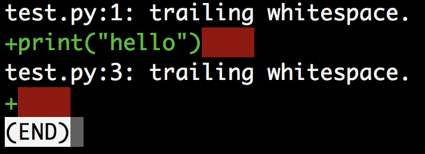

  
# git + github로 협업하기
<p align='center'>
CodeSquad Master <br>
Hoyoung Jung <br>
</p>

<p align='right'> </p>

---
<!-- page_number: true -->

# 협업하기 또는 오픈소스 프로젝트에 기여하기 
- 프로젝트의 특성에 따라 협업 / 기여 방법이 달라짐
- 개발자수, 커밋 빈도
- 워크 플로
- 접근 권한
- ...

---
# 커밋 가이드라인 
## 공백 문자 정리하기

```bash
git diff --check
```


---
## 적당한 커밋의 크기는?
- 의미있는 최소 단위가 적당 
- 수정사항은 한 주제로 요약가능
> Add file, Fix some bux, Create User model :poop:
- 여러 파일을 수정한 경우 `git add --patch` 명령 사용 

--- 
## 실습 
커밋을 살펴보고 두 개로 쪼개 봅시다. 
- https://github.com/honux77/bad-repo 클론
```
$ git checkout -b lab1 lab1
$ git log
$ git reset HEAD~1
$ git status
$ git log --oneline --graph --decorate --all 

# 적당히 add하고 다시 커밋
$ git log --oneline --graph --decorate --all 
```
* (참고) `git rebase -i` 를 이용하면 더 편하게 할 수 있습니다. 
---
## 커밋 메시지
```
영문 50글자 이하의 간략한 수정 요약

자세한 설명. 영문 72글자 이상이 되면
라인 바꿈을 하고 이어지는 내용을 작성한다.
특정 상황에서는 첫 번째 라인이 이메일
메시지의 제목이 되고 나머지는 메일
내용이 된다. 빈 라인은 본문과 요약을
구별해주기에 중요하다(본문 전체를 생략하지 않는 한).

이어지는 내용도 한 라인 띄우고 쓴다.

  - 목록 표시도 사용할 수 있다.

  - 보통 '-' 나 '*' 표시를 사용해서 목록을 표현하고
    표시 앞에 공백 하나, 각 목록 사이에는 빈 라인
    하나를 넣는데, 이건 상황에 따라 다르다.
```

---
## 실습: git/git 저장소 살펴보기
- https://github.com/git/git 
- 클론해서 적당한 시점의 커밋 메시지와 내용을 살펴봅니다. 
```
git log --no-merges
```

---
## 실습: 커밋 메시지 바꾸기
```
$ git checkout master
$ git log 
$ git commit --amend 
# 커밋 메시지 수정 
$ git log 
```

---
# git과 github를 이용한 코드리뷰 
## 규칙 
- master는 실서버에 배포될 코드만 유지한다. 
- 직접 master에서 코드를 작성하지 않는다.
- 내가 짠 브랜치를 리뷰 없이 merge하지 않는다. 
- 반드시 코드 리뷰 과정을 거친다.  

---
# 프로젝트 구성원의 경우 
- 작업 브랜치를 새로 만든다. 
- 열심히 코딩하고 애드 커밋 푸시한다.
- pull request를 보낸다. 
- 리뷰 과정을 거친다.
- 머지한다. 
> (주의) 머지 과정 중에는 브랜치에서 쓸데없는 작업을 하면 안 됨
---
# 권한이 없는 프로젝트의 경우 
## 주로 오픈소스 
- 먼저 원본 저장소를 클론한다. 
- github에서 포크를 한다.
- 포크한 저장소를 `git remote add`명령어로 등록한다.
```
git remoate add myfork 포크저장소주소
```
- 이후 과정의 앞 과정과 동일

---
# 충돌 처리
conflict가 발생하면 쫄지 말고 천천히 해결하면 된다. 
```
# 작업 브랜치에서 
$ git fetch
$ git merge origin/master 
# add, commit, 충돌해결 
$ git push myfork featureA
```

---
# 실습 
## 공동 프로젝트 pull request 보내고 리뷰 과정 연습
## 권한없는 프로젝트에 pull request 보내고 리뷰 과정 연습
## 권한없는 프로젝트, 풀리퀘, 충돌내기, 리뷰 및 머지 연습 

---
# github 없이 pull request 해보기 
```bash
$ git checkout master
$ git pull 
$ git checkout -b featureA
# ... git commit; * 2 
$ git format-fatch -M origin/master
# 생성된 패치 파일을 메일로 보냄 
# 여기부터 관리자 작업
$ git am 패치파일 
$ git log
$ git push 
```
---
# 참고자료 

- https://git-scm.com/book/ko/v2/%EB%B6%84%EC%82%B0-%ED%99%98%EA%B2%BD%EC%97%90%EC%84%9C%EC%9D%98-Git-%ED%94%84%EB%A1%9C%EC%A0%9D%ED%8A%B8%EC%97%90-%EA%B8%B0%EC%97%AC%ED%95%98%EA%B8%B0
- https://git-scm.com/book/ko/v2/Git-%EB%8F%84%EA%B5%AC-%ED%9E%88%EC%8A%A4%ED%86%A0%EB%A6%AC-%EB%8B%A8%EC%9E%A5%ED%95%98%EA%B8%B0#_rewriting_history
- https://github.com/mixed/github-usecase 
