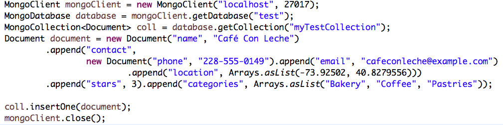

 
# mongodb 맛보기
<p align='center'>
CodeSquad Master <br>
Hoyoung Jung <br>
</p>

<p align='right'> </p>

---
<!-- page_number: true -->
# mongodb란?
- https://www.mongodb.com/
- NOSQL
- 도큐먼트 DB

---
# 몽고디비의 특징
- 사용하기 쉽다.
- 수평확장 가능
- 풍부한 쿼리 기능
- 고성능
- 고가용성
- 자동 복구
- 데이터 복제
- 다양한 스토리지 엔진 지원

---
# 데이터베이스와 콜렉션
## 데이터베이스
몽고디비의 최상위 컨테이너
## 컬렉션
데이터의 집합
## 데이터
몽고디비는 BSON으로 데이터를 저장함
- http://bsonspec.org/


---
# 설치 (ubuntu 16.04)


> sudo apt-key adv --keyserver hkp://keyserver.ubuntu.com:80 --recv 0C49F3730359A14518585931BC711F9BA15703C6

> echo "deb [ arch=amd64,arm64 ] http://repo.mongodb.org/apt/ubuntu xenial/mongodb-org/3.4 multiverse" | sudo tee /etc/apt/sources.list.d/mongodb-org-3.4.list

> sudo apt-get update

> sudo apt-get install -y mongodb-org

---

# 서비스 시작

> sudo service mongod start


* https://docs.mongodb.com/manual/tutorial/install-mongodb-on-ubuntu/

---

# mongo shell

> mongo

> db


---
# 데이터베이스 생성 및 사용
데이터베이스가 없을 경우 첫번째 데이터 생성시 디비와 콜렉션 자동 생성

> use myDB


> db.test1.insert( {x:1} )

> db.test1.find()

> db["test"].find()

> db.getCollection("test1").find();

---
# 문서 (document)
- 관계형 디비의 레코드와 같은 것
- KV 쌍의 조합으로 구성
- JSON과 거의 유사 
```
{
    foo: 3,
    bar: "some string"
}
```

---
# 콜렉션
- 테이블과 같은 것
- 강제사항은 없지만 같은 타입의 데이터를 모아서 콜렉션을 만드는 걸 권장
- 인덱스를 사용하려면 문서는 같은 구조여야 함

## 서브콜렉션
- 논리적 구분을 위해 서브콜렉션 사용 가능 (물리적으로는 의미 없음)

> blogs.post, blogs.authors
---
# shell

자바스크립트 사용 가능
> var x = -300
> Math.abs(-x)
> function foo(a) { return a + 10; }
> foo(50)
> print(x)

---

# CRUD
## Create
```
db.collection.insert()
db.collection.insertOne()
db.collection.insertMany()
```
### example
```
var post = { title : "My post", date: new Date() }
db.blog.insert(post)
```
---
## Read
```
db.collection.find()
db.collection.findOne()
```
일반적으로 커서를 사용해서 20개까지 문서를 자동으로 출력

---
## Update
```javascript
db.collection.update()
db.collection.updateOne()
db.collection.updateMany()
db.collection.replaceOne()
```
### Example
```
post.title = "My 2nd post"
post.comments = "1등"
db.blog.update({title: "My post"} ,post)
```

---
## Delete
```
db.blog.remove( {title: "My 2nd post"} )
```

---
# Data type
```
null
true / false
3.14
NumberInt("5")
NumberLong("3")
"hello"
new Date()
/foobar/i //regular expression
[1, 2, 3]
{ x: 1} //document type also can be a data
ObjectId()
```

---
## ObjectId
분산 시스템에서의 저장을 지원하기 위해 ObjectId 사용
## _id
자동 생성, 클라이언트에 의해 관리

---
# shell help
```
help
db.help()
db.collection.help()
db.collection.update
```

---
# script 실행
자바스크립트 스크립트를 바로 실행 가능
```
mongo script.js
```
|mongo shell  | js |
|------------|-----|
|use foo | db.getSisterDB("foo") |
|show dbs| db.getMongo().getDBs() |
|show collections | db.getCollectionNames()|


---
# 셸 실행
```
run('ls', '-l', 'home/honux')
```

---
# Bulk Insert and Remove
```
db.foo.insert([ {foo :1}, {foo:2}, {foo: 3}])
db.foo.remove()
for (var i = 0; i < 100000; i ++) {
  db.test.insert({foo: "test", i: i, n: 100000 - i}) }
db.test.find()
it
var id = db.test.findOne()._id
db.test.remove({_id: id})
db.test.remove({})
db.test.drop()
```

---
# Update
## update modifier
```
db.test.insert({site: "abc.com", pv: 50})
db.test.insert({site: "xyz.com", pv: 999})
db.test.update({site: "abc.com"},
  {"$inc" : {pv: 1}})
db.test.update({site: "xyz.com"},
  {"$set" : {pv: 777}})
db.test.find()
```
그 외 배열 처리, 집합 처리등 다양한 update 기능이 있음

---
# Upsert
레코드가 있으면 업데이트, 없으면 삽입
```
db.test.update({site: "stove.kr"},
  {"$inc": {pv: 50}}, true);
db.test.update({site: "stove.kr"},
  {"$inc": {pv: 50}}, true);
db.test.find()
```
---
# Query
```
db.test.find()
db.test.find({})
db.test.find({site: "abc.com"})
db.test.find({site: "abc.com"}, {site: 1})
db.test.find({site: "abc.com"}, {_id: 0})
db.test.find({pv: {"$gte": 100}})
db.test.find({site:
  {"$in": ["abc.com", "stove.kr"]}})


```
> $gt, $gte, $lte, $ne 등 사용 가능
>
> $or, $and, $not 등도 사용 가능
>
>
> 정규표현식도 사용 가능
> 기타 풍부한 쿼리 기능을 가지고 있음


---
# cursor
```
var arr  = []
for (var i = 0; i < 100; i ++) {
  arr.push({foo: "test2", value: i})}
db.test2.insert(arr)
cursor.hasText()
cursor.next()
```

---
# skip과 limit
```
db.test2.find().limit(20)
db.test2.find().skip(20).limit(20)
```
문서 수가 많을 때 skip 을 사용하면 성능저하가 발생함!
페이징 쿼리는 어떻게 구현하는 게 좋을까?

---
# explain과 index
```
db.test2.find().explain()
db.test2.find({value: {$gt: 50}}).explain()
db.test2.ensureIndex({value: 1})
```
복합 인덱스와 다양한 자료형의 인덱스를 지원함
커버링 인덱스도 사용 가능

---
# 기타 몽고디비의 주요 기능
## 제한 콜렉션
## TTL 인덱스
## full text search
## 공간 정보 인덱스
## GridFS
## map/reduce
## 통계

---
# Replication Test
> mongo --nodb
> rs = new ReplSetTest({nodes: 3})
> rs.startSet()
> rs.initiate()
> var con1 = new Mongo("localhost:20000")
> pdb = con1.getDB("test")
> pdb.isMaster()
> for (var i = 0; i < 100; i ++) {
>   pdb.coll.insert({foo: "repl", value: i})}

---
# Replication Test
> var con2 = new Mongo("localhost:20001")
> sdb = con2.getDB("test")
> sdb.isMaster()
> sdb.coll.find()
> sdb.setSlaveOk()
> sdb.coll.count()
> sedb.coll.find()
> pdb.adminCommand({shutdown: 1})
> sdb.isMaster()
> rs.stopSet()

---
# Join?
조인 같은 거 없다.
## embedded document 또는
## reference 를 사용하면 1:N 관계 표현 가능

https://docs.mongodb.com/manual/reference/database-references/


---
# MongoDB + JAVA

https://docs.mongodb.com/ecosystem/drivers/java/

---


---
# POJO

Morphia
Spring MongoDB
Hibernate OGM
...

---
Thank You :+1:
